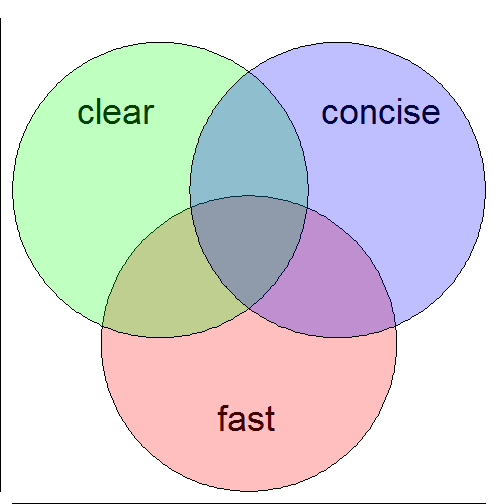

Idiomatic Optimization:  simpler, faster R code 
========================================================
author: Robert Horton, PhD, MS
date: December 8, 2014


Intended Audience
========================================================
This presentation assumes that you: 
* have some experience with R programming
* know how to decompose problems and write functions
* are familiar with the fundamental R data structures
* can write code that gives correct answers, even if it is slow
* want to make your code simpler and faster

Idiomatic Optimization
========================================================

 
***
We will look at ways to make your code shorter, easier to understand, and faster, all at the same time.

This is not premature optimization; we want to make the code concise and clear anyway.


Quiz
========================================================

Given a function like this:

```r
f <- function(n) (1 + 1/n)^n
```
What is the fastest way to run the function on a series of inputs?
* y <- numeric(); for (i in seq_along(x)) y[i] <- f(x[i])
* y <- numeric(length(x)); for (i in seq_along(x)) y[i] <- f(x[i])
* y <- sapply(x, f)
* y <- vapply(x, f, numeric(1))


Trick Question!  y <- f(x)
========================================================

```r
x <- 1:1000
```
 


Performance
========================================================


 

Case Study
========================================================

[](http://shop.oreilly.com/product/0636920018483.do)
***
* Book organized as a series of case studies presenting increasingly complex machine learning approaches
* Programming perspective, rather than straight math
* Well-known authors, respected publisher, fairly popular book
* Examples are all in R
* Code is not idiomatic

Code Breaking as an Optimization Problem
========================================================
* Toy problem: use Metropolis algorithm to solve a simple substitution cipher
    - A (secret) permutation of the alphabet has been used to encipher a message
    - Try to find the best permutation to reverse the cipher
* Uses a large dictionary of English words and their observed probability of occurrence in training text
    - look for recognizable words in output
    - score message by product of word probabilities
* Requires many iterations of testing and modification

Improvement of Scores Across Iterations
========================================================


```
processing file: idiomatic_optimization.Rpres
Loading required package: ggplot2
Loading required package: microbenchmark
  % Total    % Received % Xferd  Average Speed   Time    Time     Time  Current
                                 Dload  Upload   Total   Spent    Left  Speed

  0     0    0     0    0     0      0      0 --:--:-- --:--:-- --:--:--     0Quitting from lines 179-270 (idiomatic_optimization.Rpres) 
Error: no input is available
In addition: Warning message:
In library(package, lib.loc = lib.loc, character.only = TRUE, logical.return = TRUE,  :
  there is no package called 'microbenchmark'

  2  597k    2 15335    0     0  28034      0  0:00:21 --:--:--  0:00:21 28879
curl: (23) Failed writing body (0 != 7143)
Execution halted
```
